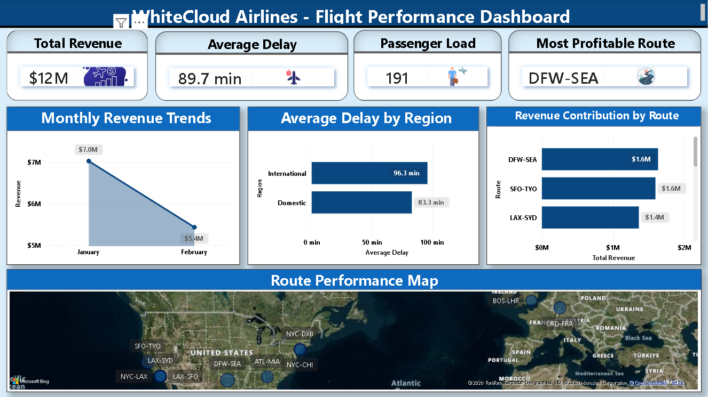

# Airline-Flight-Performance-Analysis
Power BI dashboard analyzing airline flight performance, revenue, profit, passengers, routes, regions, and flight delays.

## 📌 Overview

This project uses Power BI to analyze airline flight performance across routes and regions. The dashboard explores passenger volume, revenue, profit, flight delays, and overall operational performance using data from 187 flight records.

## 📊 Dashboard Preview

### Flight Performance

## 📂 Repository Files

* `airline_flight_performance.pbix` — Power BI dashboard containing the complete analysis and visualizations.
* `airline_performance.csv` — Source dataset containing flight, route, passenger, revenue, delay, and profit information.
* `01_flight_performance.png` — Dashboard screenshot for portfolio preview.
* `README.md` — Project documentation and key findings.

## 🛠️ Key Techniques

* Data loading and transformation in Power BI
* Data modeling and field categorization
* DAX measures and calculated metrics
* KPI analysis
* Interactive filtering and slicers
* Flight-level performance analysis
* Route and regional comparison
* Passenger volume analysis
* Revenue and profit analysis
* Flight delay analysis
* Data visualization using charts, cards, and tables

## 🔍 Key Insights

* Analyzed passenger volume across different flight routes and regions.
* Compared revenue and profit generated by flights.
* Evaluated flight delays to identify operational performance patterns.
* Compared domestic and international flight performance.
* Examined route-level differences in passengers, revenue, profit, and delays.
* Identified relationships between passenger volume, revenue, and profitability.

## 💡 Recommendations

* Monitor routes with consistently high delays to improve operational efficiency.
* Focus on routes with strong passenger demand and profitability.
* Review underperforming routes based on revenue and profit.
* Track delay patterns regularly to identify opportunities for improving customer experience.
* Use route and regional performance analysis to support future operational and business decisions.
